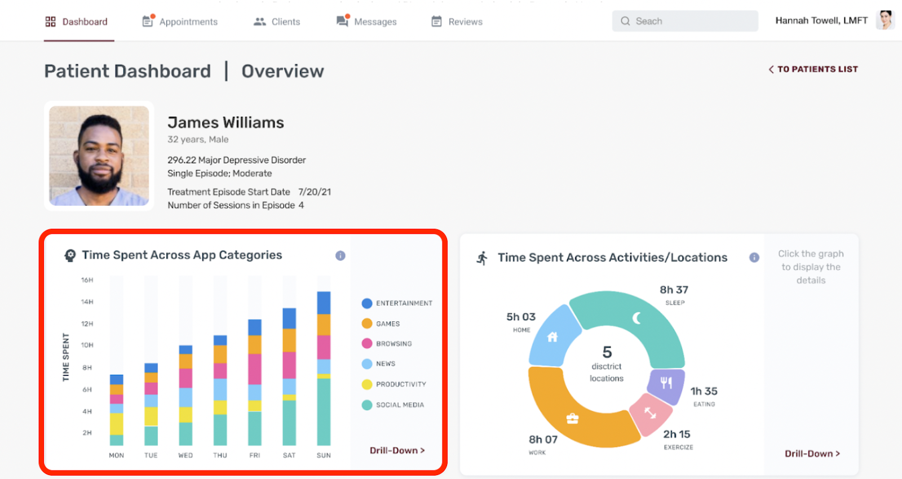

# Welcome!

## About this challenge

Below, you'll find 3 exercises we've designed to represent the work you may encounter in this role. There is no single right answer — we've left these intentionally open-ended to see how you think.

After testing this challenge with our team, we estimate that it will take around **90 minutes** to complete these exercises. We will give personalized feedback for your submission.

We designed this hiring challenge to:

1. Learn as much as we can about how you work.
2. Require as little of your time as possible. By limiting this to an hour and a half, we hope this is manageable with your busy schedule.
3. Introduce you to the types of challenges you might encounter in this role.

## Background

For this challenge, we want to evaluate your ability to work with code on the front-end and back-end, to manipulate data for visualization, and to make decisions in an independent context. Feel free to use Google or any other resources you have at your disposal.

In this scenario, we are building an initial prototype for a dashboard for providers to quickly see the status for a given patient. See the mockup image below to see what we have in mind.

So far there is a prototype for a back-end server written in Node / Express / TypeScript) that exposes data from a SQLite database, and a prototype front-end using [React Native](https://reactnative.dev/docs/getting-started) (with [Expo](https://docs.expo.dev/) for convenience). We've also included basic native charting templates for [victory](https://formidable.com/open-source/victory/docs).

> NOTE: You are **NOT** required to use any of these (i.e. Expo, Victory). We provide them for convenience to hopefully save you time. If there is a different data visualization library that works with React Native that you are more familiar with, **_please use it instead_**. We will not penalize you based on your choice.

### Getting Started

- Run the back-end server in the `backend` directory
  - Navigate to the server directory with `cd backend`
  - Install dependencies with `yarn install`
  - Run the server with autoreload: `yarn watch`
  - The server should now be accessible from `localhost:8000`
- Run the front-end server in the `frontend` directory
  - Navigate to the frontend directory with `cd frontend`
  - Install dependencies with `yarn install`
  - Run the server with autoreload: `yarn expo`
  - There should now be a message with instructions for options to access your app:
    - If you have the Expo app installed on a mobile device, you can scan a QR code to open it
    - If you have mobile emulators installed locally, you should be able to use shortcut keys to open the running app with them
    - You should also be able to open the web version of app with 'w'. Note that victory-native does not work on web. You could change the imports to `victory` for testing, but ultimately we will be running your code on mobile.

> NOTE: Please commit your work regularly, just as you would on the job.

## Part 1: Data Visualization

_60 min_

Your task is to implement an initial working version of the "Time Spent Across App Categories" chart in the bottom left of the mock-up. We are NOT expecting a pixel-perfect implementation in such a short time, but we want to use this limited work sample to better understand how you approach these types of problems.

There is a minimal placeholder vertical bar graph already in place with meaningless data written with `victory`. Bear in mind that if you are accessing the app from a mobile device you'll need to reference the local IP address of your development machine.

Don't feel as though you need to implement anything other than the bar graph shown and making it able to retrieve data from the database.

> NOTE: Again, you are **NOT** required to use either of the two templated data visualization libraries. If there is a data visualization library you are more comfortable with, **_please use it instead_**. We won't penalize you at all based on this choice. The basic templates are provided for convenience, but we don't expect starting over with a different library to add significant time.

## Part 2: Discussion

_15 min_

We'd like to hear more about your thought process in Part 1:

- For this challenge we asked you to limit your time to 60 min. If you instead had a couple hours, what would your next steps be? What if you had several days?
- If you had to do this again, would you approach it any differently?
- Let's say one of the improvements we wanted to make was to allow updates from the back-end to be able to flow to the front-end seamlessly. How would you approach solving this problem? How would the back-end and the front-end need to change from the current implementation?

Please write your responses in the `discussion.md` file. You won't be evaluated on your familiarity with Markdown.

## Part 3: Prioritization

_15 min_

As a founding engineer, your contribution to Aware's company and mission will go far beyond the code you write. One of the areas where your impact will be felt the most is in prioritizing which engineering tasks we work on, and in what order. To simulate the types of decisions you would help us make, we've listed a few hypothetical initiatives we could tackle:

1. Integrate survey functionality so providers can gather data on patients before they arrive to their appointments.
2. Add analytics (e.g. Mixpanel) to collect data on how providers are using the product, such as which visualizations they view drill-downs for, in which order, etc.
3. Spike an issue that’s causing 15% of patient biomarker data to be lost before it makes it to the database, ensuring that the data shown is as robust as possible.
4. Reduce page load time from 2.5s to 0.5s on web by refactoring database queries, introducing caching, and optimizing visualization formats.
5. Build a red/yellow/green system to help providers evaluate the severity of symptoms, based on the patient's change in behavior. For example, if a patient has depression and their typing speed decreased by 70% that could be a sign of psychomotor retardation (a key symptom of depression) and is worth highlighting more than their screen time going up by 10% that week.

Which initiatives would you prioritize and why? Please write your response in the `discussion.md` file.

> NOTE: We aren't looking for a 'right' answer here, since we're more interested in understanding your thought process and problem solving approach.

## Submitting your work

Add any deliverables to the directory, then commit and push your changes with `git commit` and `git push`.

Finally, navigate to the exercise landing page (you can find the link in your email), check that the latest commit shown is accurate, and then click the submit button. This will notify the engineers on our team that your work is ready for review.
